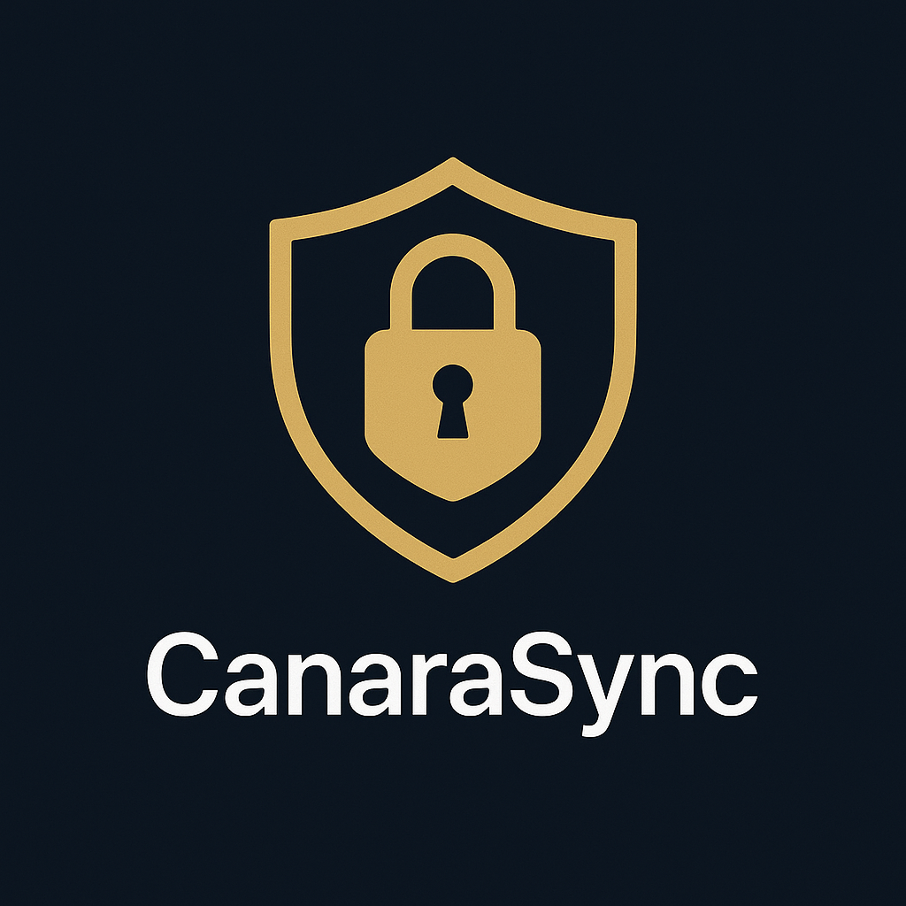
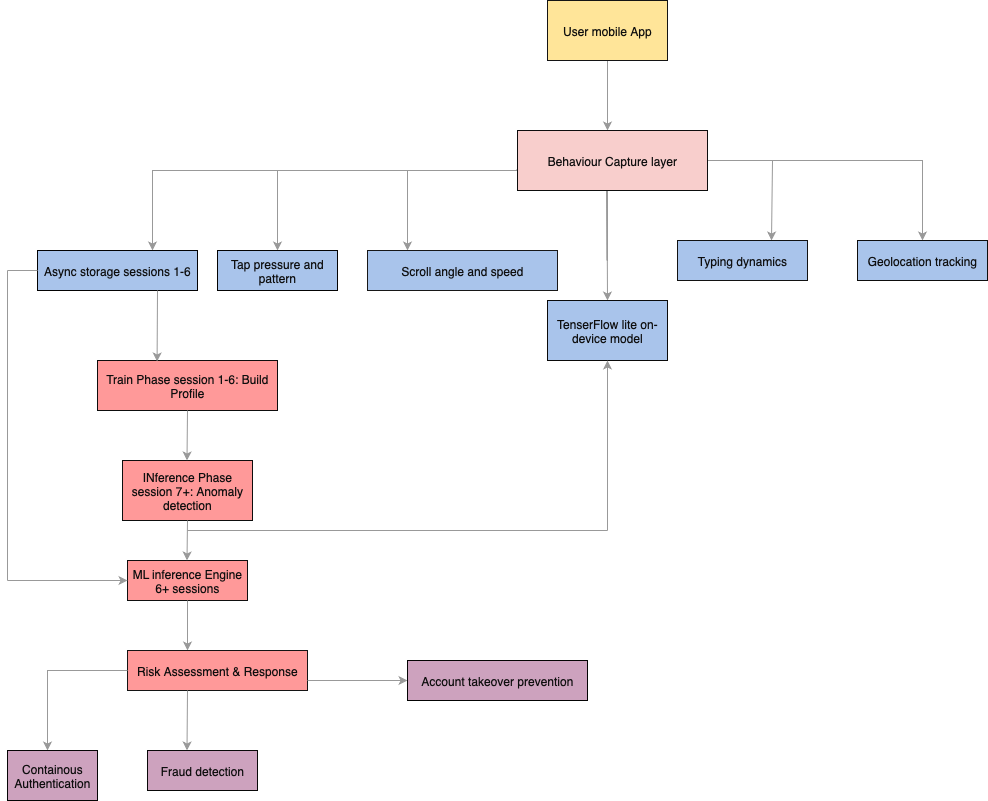
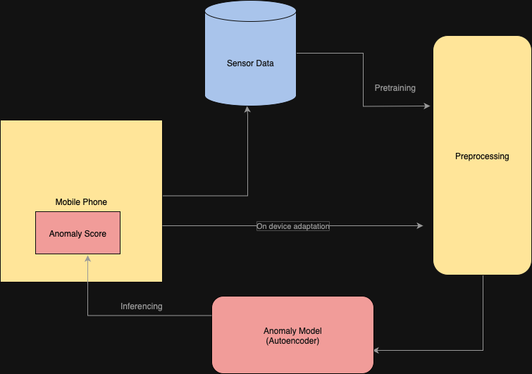

# CanaraSync.AI   
**Security that Syncs with Your Every Move**  
Team Cyber Siren | SuRaksha Cyber Hackathon 2025  
<p align="center">
  
</p>

CanaraSync.AI is an AI-powered mobile app that enhances mobile banking security using behavioral biometrics and on-device TinyML. It learns your gestures—tap, scroll, typing rhythm—to detect anomalies and silently protect your sessions.

---

##  Key Features

- **Behavioral Biometrics**: Learns user patterns across 6 sessions; flags anomalies from the 7th.
- **Gesture + Geo Intelligence**: Monitors touch behavior and location context.
- **Offline-First**: Operates even in rural or low-connectivity areas.
- **On-Device TinyML**: Runs AI locally using TensorFlow Lite for privacy.
- **Silent Reauthentication**: Detects suspicious activity without disrupting the user.

---

##  Privacy & Compliance

- Complies with **DPDP Act 2023 (India)** & **GDPR**
- No cloud storage — all data stays local via AsyncStorage
- Data auto-deletes upon uninstall
- Consent-first usage, no background tracking

---

##  Tech Stack

| Layer        | Technology                          |
|--------------|--------------------------------------|
| Frontend     | React Native (Expo), TypeScript      |
| AI/ML        | TensorFlow Lite, Custom Autoencoder  |
| Storage      | AsyncStorage, Expo-Location          |
| Testing      | Jest, RN Testing Library, Expo Go    |

---

##  High-Level Architecture

The app follows a modular, offline-first architecture:

- UI Layer (React Native)
- Gesture Capture Layer (Tap, Scroll, Typing)
- Local Storage (AsyncStorage)
- TinyML Engine (Anomaly Detection)
- Security Layer (Reauth trigger, session control)

###  High-Level Architecture Diagram


> *Diagram showing modular structure: UI ↔ Gesture Logger ↔ AsyncStorage ↔ TFLite Inference Engine*

---

##  Behavioral Data Pipeline

This shows how data flows within the app from gesture input to security response.

###  Data Pipeline Diagram


> *Data flows: User Gesture → Data Logger → AsyncStorage → TFLite Model → Anomaly Detection → Reauthentication Trigger*

---

##  App Architecture Highlights

- Modular directory: `/screens`, `/hooks`, `/utils`, `/ml_model`
- Centralized gesture logger and AsyncStorage data store
- ML model inference happens on-device after 6 sessions of training
- All collected data is JSON-formatted and encrypted locally

---

##  Future Scope

-  Duress gestures for silent SOS
-  Federated Learning (future privacy-preserving updates)
-  Multi-user support on shared devices
-  Admin dashboard with anomaly heatmaps
-  SDKs for easy fintech integration

---

##  Installation

```bash
git clone https://github.com/anchal405/CanraSync.AI.git
cd CanaraSync.AI
npm install
npm install -g expo-cli # if not already installed
npx expo start

